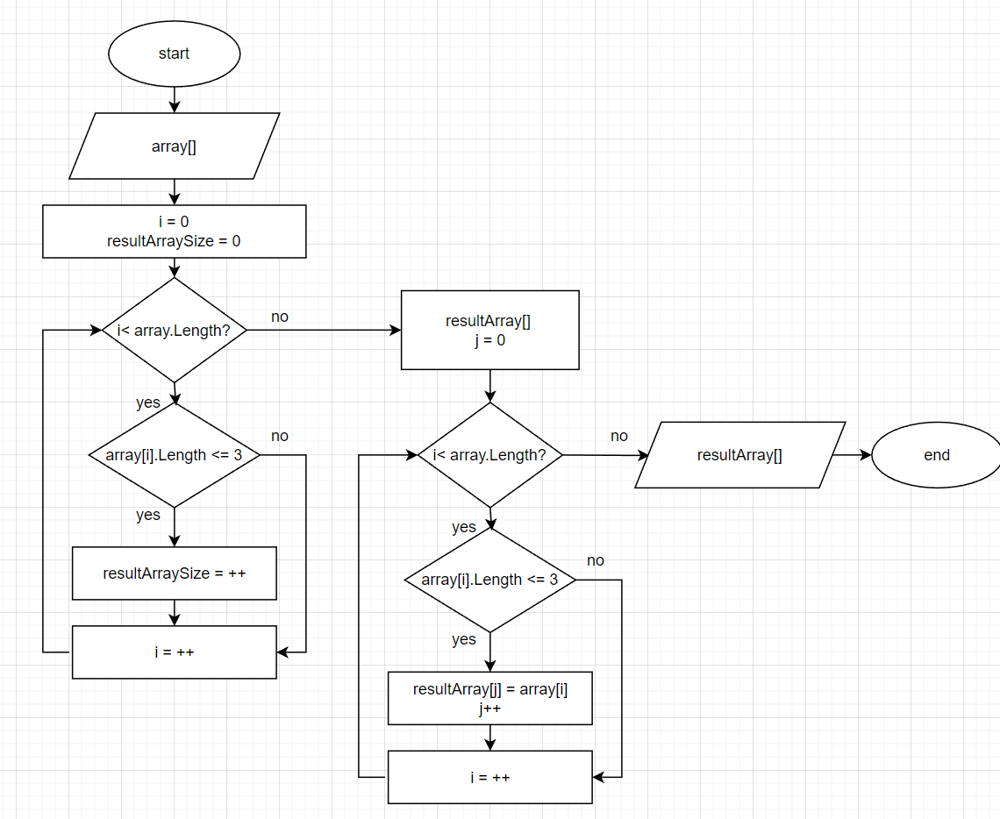

# Алгоритм решает задачу:
*Из имеющегося массива строк сформировать массив строк, длина которых меньше либо ровна 3*

## Блок схема алгоритма:




# Описание алгоритма

Первоначальный массив задан на старте выполнения алгоритма

```с#
string[] array = {"one", "two", "three", "four", "five", "six", "seven", "-1", ":)"}
```

Т.к в C# нет динамических массивов, нужно сначала найти длину массива, который получится в результате выполнения поставленной задачи. 

```c#
int resultArraySize = 0;

for (int i = 0; i < array.Length; i++)
{
    if (array[i].Length <= 3) 
        resultArraySize++;
}
```

Теперь можно объявить новый массив с известной длиной, куда будут сохраняться элементы, удовлетворяющие условию задачи.

```c#
string[] resultArray =  new string[resultArraySize];
```

Новым пробегом по исходному массиву, запишем в результирующий массив найденные элементы, длина которых меньше или равна 3.

```c#
int j = 0;

for (int i = 0; i < array.Length; i++)
{
    if (array[i].Length <= 3) 
    {
        resultArray[j] = array[i];
        j++;
    }
}
```
Выводим исходный массив и массив с результатом, использую метод PrintArray/
```c#
void PrintArray(string[] array)
{
    for (int i = 0; i < array.Length; i++)
    {
        Console.Write($"{array[i]} ");
    }
    Console.WriteLine();
}
```
